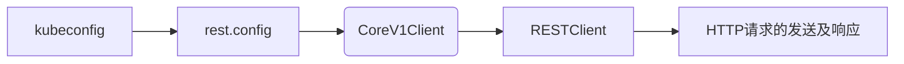

# 1. 简介

client-go是一个调用kubernetes集群资源对象API的客户端，即通过client-go实现对kubernetes集群中资源对象（包括deployment、service、ingress、replicaSet、pod、namespace、node等）的增删改查等操作。

```bash
go get k8s.io/client-go@v0.19.11
go get k8s.io/apimachinery@v0.19.11
```

源码目录说明：

- `kubernetes`：访问  Kubernetes API 的客户端集合 clientset
-  `discovery`：发现 Kubernetes API server 支持的 APIs
- `dynamic`: 动态客户端， 可对任意的 Kubernetes API 对象执行通用操作.
- `plugin/pkg/client/auth` ：外部接入时，身份验证插件
- `transport`： 设置身份认证及启动链接
- `tools/cache`：编写控制器时，可能会用到


# 2. 源码分析

获取Pod信息：

```go
import (
	"context"
	"flag"
	"fmt"
	"os"
	"path/filepath"
	"time"

	"k8s.io/client-go/kubernetes"
	"k8s.io/client-go/tools/clientcmd"

	metav1 "k8s.io/apimachinery/pkg/apis/meta/v1"
)

func main() {
	var kubeconfig *string
	if home := homeDir(); home != "" {
		kubeconfig = flag.String("kubeconfig", filepath.Join(home, ".kube", "config"), "(optional) absolute path to the kubeconfig file")
	} else {
		kubeconfig = flag.String("kubeconfig", "", "absolute path to the kubeconfig file")
	}
	flag.Parse()

	config, err := clientcmd.BuildConfigFromFlags("", *kubeconfig)
	if err != nil {
		panic(err)
	}

	clientset, err := kubernetes.NewForConfig(config)
	if err != nil {
		panic(err)
	}

	for {
		ctx, cancel := context.WithTimeout(context.TODO(), 3*time.Second)
		pods, err := clientset.CoreV1().Pods("default").List(ctx, metav1.ListOptions{})
		if err != nil {
			panic(err)
		}
		cancel()
		fmt.Printf("There are %d pods in the cluster\n", len(pods.Items))
		for _, pod := range pods.Items {
			fmt.Printf("Pod Name: %v\n", pod.GetName())
			fmt.Printf("Pod IPs: %v\n", pod.Status.PodIPs)
			fmt.Printf("Pod Message: %v\n", pod.Status.Message)
			for index, container := range pod.Status.ContainerStatuses {
				fmt.Printf("************* Container: %d *************\n", index)
				fmt.Printf("ID: %v\n", container.ContainerID)
				fmt.Printf("Name: %v\n", container.Name)
				fmt.Printf("Image: %v\n", container.Image)
				fmt.Printf("ImageID: %v\n", container.ImageID)
				fmt.Printf("Started: %v\n", *container.Started)
				fmt.Printf("Ready: %v\n", container.Ready)
				fmt.Printf("RestartCount: %v\n", container.RestartCount)
				fmt.Printf("State: %v\n", container.State.String())
			}
			fmt.Printf("Pod HostIP: %v\n", pod.Status.HostIP)
			fmt.Printf("Pod Phase: %v\n", pod.Status.Phase)
			fmt.Printf("Pod Reason: %v\n", pod.Status.Reason)
			fmt.Printf("Pod Annotations: %v\n", pod.Annotations)
			fmt.Printf("---------------------------------------\n")
		}
		time.Sleep(10 * time.Second)
	}
}

func homeDir() string {
	if h := os.Getenv("HOME"); h != "" {
		return h
	}

	return os.Getenv("USERPROFILE")
}
```


## 2.1 kubeconfig

集群管理配置，包含API Server地址及相关证书和密钥。主要用来配置本地客户端连接到kubernetes集群。

```go
kubeconfig = flag.String("kubeconfig", filepath.Join(home, ".kube", "config"), "(optional) absolute path to the kubeconfig file")
```

```bash
cat $HOME/.kube/config
apiVersion: v1
clusters:
- cluster:
    certificate-authority-data: LS0tLS1CRUdJTiBDRVJUSUZJ...
    server: https://192.168.80.45:6443
  name: kubernetes
contexts:
- context:
    cluster: kubernetes
    user: cluster-admin
  name: default
current-context: default
kind: Config
preferences: {}
users:
- name: cluster-admin
  user:
    client-certificate-data: LS0tLS1CRUdJTiBDRVJUSUZJQ0FU...
    client-key-data: LS0tLS1CRUdJTiBSU0EgUFJJVkF...
```


## 2.2 rest.config

restful api 接口访问配置，通过参数（master的url或者kubeconfig路径）和`BuildConfigFromFlags`方法来获取`rest.Config`对象，一般是通过参数kubeconfig的路径。

```go
config, err := clientcmd.BuildConfigFromFlags("", *kubeconfig)
```

```go
// BuildConfigFromFlags is a helper function that builds configs from a master
// url or a kubeconfig filepath. These are passed in as command line flags for cluster
// components. Warnings should reflect this usage. If neither masterUrl or kubeconfigPath
// are passed in we fallback to inClusterConfig. If inClusterConfig fails, we fallback
// to the default config.
func BuildConfigFromFlags(masterUrl, kubeconfigPath string) (*restclient.Config, error) {
	if kubeconfigPath == "" && masterUrl == "" {
		klog.Warning("Neither --kubeconfig nor --master was specified.  Using the inClusterConfig.  This might not work.")
		kubeconfig, err := restclient.InClusterConfig()
		if err == nil {
			return kubeconfig, nil
		}
		klog.Warning("error creating inClusterConfig, falling back to default config: ", err)
	}
	return NewNonInteractiveDeferredLoadingClientConfig(
		&ClientConfigLoadingRules{ExplicitPath: kubeconfigPath},
		&ConfigOverrides{ClusterInfo: clientcmdapi.Cluster{Server: masterUrl}}).ClientConfig()
}
```


## 2.3 clientset

通过`*rest.Config`参数和`NewForConfig`方法来获取`clientset`对象，`clientset`是多个`client`的集合，每个`client`可能包含不同版本的方法调用。

```go
clientset, err := kubernetes.NewForConfig(config)
```


### 2.3.1 NewForConfig

初始化clientset中的每个client

```go
// NewForConfig creates a new Clientset for the given config.
func NewForConfig(c *rest.Config) (*Clientset, error) {
	configShallowCopy := *c
	if configShallowCopy.RateLimiter == nil && configShallowCopy.QPS > 0 {
		configShallowCopy.RateLimiter = flowcontrol.NewTokenBucketRateLimiter(configShallowCopy.QPS, configShallowCopy.Burst)
	}
	var cs Clientset
    ...
    cs.appsV1, err = appsv1.NewForConfig(&configShallowCopy)
    ...
    cs.coreV1, err = corev1.NewForConfig(&configShallowCopy)
	...
    cs.DiscoveryClient, err = discovery.NewDiscoveryClientForConfig(&configShallowCopy)
	if err != nil {
		glog.Errorf("failed to create the DiscoveryClient: %v", err)
		return nil, err
	}
	return &cs, nil
}
```


### 2.3.2 Clientset

```go
// Clientset contains the clients for groups. Each group has exactly one
// version included in a Clientset.
type Clientset struct {
	*discovery.DiscoveryClient
	admissionregistrationV1alpha1 *admissionregistrationv1alpha1.AdmissionregistrationV1alpha1Client
	admissionregistrationV1beta1  *admissionregistrationv1beta1.AdmissionregistrationV1beta1Client
	appsV1beta1                   *appsv1beta1.AppsV1beta1Client
	appsV1beta2                   *appsv1beta2.AppsV1beta2Client
	appsV1                        *appsv1.AppsV1Client
	authenticationV1              *authenticationv1.AuthenticationV1Client
	authenticationV1beta1         *authenticationv1beta1.AuthenticationV1beta1Client
	authorizationV1               *authorizationv1.AuthorizationV1Client
	authorizationV1beta1          *authorizationv1beta1.AuthorizationV1beta1Client
	autoscalingV1                 *autoscalingv1.AutoscalingV1Client
	autoscalingV2beta1            *autoscalingv2beta1.AutoscalingV2beta1Client
	batchV1                       *batchv1.BatchV1Client
	batchV1beta1                  *batchv1beta1.BatchV1beta1Client
	batchV2alpha1                 *batchv2alpha1.BatchV2alpha1Client
	certificatesV1beta1           *certificatesv1beta1.CertificatesV1beta1Client
	coreV1                        *corev1.CoreV1Client
	eventsV1beta1                 *eventsv1beta1.EventsV1beta1Client
	extensionsV1beta1             *extensionsv1beta1.ExtensionsV1beta1Client
	networkingV1                  *networkingv1.NetworkingV1Client
	policyV1beta1                 *policyv1beta1.PolicyV1beta1Client
	rbacV1                        *rbacv1.RbacV1Client
	rbacV1beta1                   *rbacv1beta1.RbacV1beta1Client
	rbacV1alpha1                  *rbacv1alpha1.RbacV1alpha1Client
	schedulingV1alpha1            *schedulingv1alpha1.SchedulingV1alpha1Client
	settingsV1alpha1              *settingsv1alpha1.SettingsV1alpha1Client
	storageV1beta1                *storagev1beta1.StorageV1beta1Client
	storageV1                     *storagev1.StorageV1Client
	storageV1alpha1               *storagev1alpha1.StorageV1alpha1Client
}
```


### 2.3.3 clientset.Interface

clientset实现Interface，可通过调用相关方法获得具体的client

```go
pods, err := clientset.CoreV1().Pods("default").List(ctx, metav1.ListOptions{})
```

```go
type Interface interface {
	Discovery() discovery.DiscoveryInterface
	AdmissionregistrationV1alpha1() admissionregistrationv1alpha1.AdmissionregistrationV1alpha1Interface
	AdmissionregistrationV1beta1() admissionregistrationv1beta1.AdmissionregistrationV1beta1Interface
	// Deprecated: please explicitly pick a version if possible.
	Admissionregistration() admissionregistrationv1beta1.AdmissionregistrationV1beta1Interface
	AppsV1beta1() appsv1beta1.AppsV1beta1Interface
	AppsV1beta2() appsv1beta2.AppsV1beta2Interface
	AppsV1() appsv1.AppsV1Interface
	// Deprecated: please explicitly pick a version if possible.
	Apps() appsv1.AppsV1Interface
	AuthenticationV1() authenticationv1.AuthenticationV1Interface
	// Deprecated: please explicitly pick a version if possible.
	Authentication() authenticationv1.AuthenticationV1Interface
	AuthenticationV1beta1() authenticationv1beta1.AuthenticationV1beta1Interface
	AuthorizationV1() authorizationv1.AuthorizationV1Interface
	// Deprecated: please explicitly pick a version if possible.
	Authorization() authorizationv1.AuthorizationV1Interface
	AuthorizationV1beta1() authorizationv1beta1.AuthorizationV1beta1Interface
	AutoscalingV1() autoscalingv1.AutoscalingV1Interface
	// Deprecated: please explicitly pick a version if possible.
	Autoscaling() autoscalingv1.AutoscalingV1Interface
	AutoscalingV2beta1() autoscalingv2beta1.AutoscalingV2beta1Interface
	BatchV1() batchv1.BatchV1Interface
	// Deprecated: please explicitly pick a version if possible.
	Batch() batchv1.BatchV1Interface
	BatchV1beta1() batchv1beta1.BatchV1beta1Interface
	BatchV2alpha1() batchv2alpha1.BatchV2alpha1Interface
	CertificatesV1beta1() certificatesv1beta1.CertificatesV1beta1Interface
	// Deprecated: please explicitly pick a version if possible.
	Certificates() certificatesv1beta1.CertificatesV1beta1Interface
	CoreV1() corev1.CoreV1Interface
	// Deprecated: please explicitly pick a version if possible.
	Core() corev1.CoreV1Interface
	EventsV1beta1() eventsv1beta1.EventsV1beta1Interface
	// Deprecated: please explicitly pick a version if possible.
	Events() eventsv1beta1.EventsV1beta1Interface
	ExtensionsV1beta1() extensionsv1beta1.ExtensionsV1beta1Interface
	// Deprecated: please explicitly pick a version if possible.
	Extensions() extensionsv1beta1.ExtensionsV1beta1Interface
	NetworkingV1() networkingv1.NetworkingV1Interface
	// Deprecated: please explicitly pick a version if possible.
	Networking() networkingv1.NetworkingV1Interface
	PolicyV1beta1() policyv1beta1.PolicyV1beta1Interface
	// Deprecated: please explicitly pick a version if possible.
	Policy() policyv1beta1.PolicyV1beta1Interface
	RbacV1() rbacv1.RbacV1Interface
	// Deprecated: please explicitly pick a version if possible.
	Rbac() rbacv1.RbacV1Interface
	RbacV1beta1() rbacv1beta1.RbacV1beta1Interface
	RbacV1alpha1() rbacv1alpha1.RbacV1alpha1Interface
	SchedulingV1alpha1() schedulingv1alpha1.SchedulingV1alpha1Interface
	// Deprecated: please explicitly pick a version if possible.
	Scheduling() schedulingv1alpha1.SchedulingV1alpha1Interface
	SettingsV1alpha1() settingsv1alpha1.SettingsV1alpha1Interface
	// Deprecated: please explicitly pick a version if possible.
	Settings() settingsv1alpha1.SettingsV1alpha1Interface
	StorageV1beta1() storagev1beta1.StorageV1beta1Interface
	StorageV1() storagev1.StorageV1Interface
	// Deprecated: please explicitly pick a version if possible.
	Storage() storagev1.StorageV1Interface
	StorageV1alpha1() storagev1alpha1.StorageV1alpha1Interface
}
```


## 2.4 CoreV1Client

```go
import corev1 "k8s.io/client-go/kubernetes/typed/core/v1"

corev1Client, err := corev1.NewForConfig(config)

corev1, err = corev1.NewForConfig(&configShallowCopy)

// CoreV1Client is used to interact with features provided by the  group.
type CoreV1Client struct {
	restClient rest.Interface
}
```

### 2.4.1 corev1.NewForConfig

本质是调用了`rest.RESTClientFor(&config)`方法创建`RESTClient`对象，即`CoreV1Client`的就是一个`RESTClient`对象。

```go
// NewForConfig creates a new CoreV1Client for the given config.
func NewForConfig(c *rest.Config) (*CoreV1Client, error) {
	config := *c
	if err := setConfigDefaults(&config); err != nil {
		return nil, err
	}
	client, err := rest.RESTClientFor(&config)
	if err != nil {
		return nil, err
	}
	return &CoreV1Client{client}, nil
}
```

### 2.4.2 CoreV1Client结构体

`CoreV1Client`实现了`CoreV1Interface`的接口，从而对kubernetes的资源对象进行增删改查的操作。

```go
// CoreV1Client is used to interact with features provided by the  group.
type CoreV1Client struct {
	restClient rest.Interface
}

func (c *CoreV1Client) ComponentStatuses() ComponentStatusInterface {
	return newComponentStatuses(c)
}

func (c *CoreV1Client) ConfigMaps(namespace string) ConfigMapInterface {
	return newConfigMaps(c, namespace)
}

func (c *CoreV1Client) Endpoints(namespace string) EndpointsInterface {
	return newEndpoints(c, namespace)
}

func (c *CoreV1Client) Events(namespace string) EventInterface {
	return newEvents(c, namespace)
}

func (c *CoreV1Client) LimitRanges(namespace string) LimitRangeInterface {
	return newLimitRanges(c, namespace)
}

func (c *CoreV1Client) Namespaces() NamespaceInterface {
	return newNamespaces(c)
}

func (c *CoreV1Client) Nodes() NodeInterface {
	return newNodes(c)
}

func (c *CoreV1Client) PersistentVolumes() PersistentVolumeInterface {
	return newPersistentVolumes(c)
}

func (c *CoreV1Client) PersistentVolumeClaims(namespace string) PersistentVolumeClaimInterface {
	return newPersistentVolumeClaims(c, namespace)
}

func (c *CoreV1Client) Pods(namespace string) PodInterface {
	return newPods(c, namespace)
}

func (c *CoreV1Client) PodTemplates(namespace string) PodTemplateInterface {
	return newPodTemplates(c, namespace)
}

func (c *CoreV1Client) ReplicationControllers(namespace string) ReplicationControllerInterface {
	return newReplicationControllers(c, namespace)
}

func (c *CoreV1Client) ResourceQuotas(namespace string) ResourceQuotaInterface {
	return newResourceQuotas(c, namespace)
}

func (c *CoreV1Client) Secrets(namespace string) SecretInterface {
	return newSecrets(c, namespace)
}

func (c *CoreV1Client) Services(namespace string) ServiceInterface {
	return newServices(c, namespace)
}

func (c *CoreV1Client) ServiceAccounts(namespace string) ServiceAccountInterface {
	return newServiceAccounts(c, namespace)
}
```

### 2.4.3 CoreV1Interface

`CoreV1Interface`中包含了各种`kubernetes`对象的调用接口，例如`PodsGetter`是对kubernetes中`pod`对象增删改查操作的接口。`ServicesGetter`是对`service`对象的操作的接口

```go
type CoreV1Interface interface {
	RESTClient() rest.Interface
	ComponentStatusesGetter
	ConfigMapsGetter
	EndpointsGetter
	EventsGetter
	LimitRangesGetter
	NamespacesGetter
	NodesGetter
	PersistentVolumesGetter
	PersistentVolumeClaimsGetter
	PodsGetter
	PodTemplatesGetter
	ReplicationControllersGetter
	ResourceQuotasGetter
	SecretsGetter
	ServicesGetter
	ServiceAccountsGetter
}
```

### 2.4.4 PodsGetter

```go
pods, err := clientset.CoreV1().Pods("").List(metav1.ListOptions{})
```

**CoreV1().Pods():**

```go
func (c *CoreV1Client) Pods(namespace string) PodInterface {
	return newPods(c, namespace)
}

// newPods returns a Pods
func newPods(c *CoreV1Client, namespace string) *pods {
	return &pods{
		client: c.RESTClient(),
		ns:     namespace,
	}
}

// pods implements PodInterface
type pods struct {
	client rest.Interface
	ns     string
}

// PodInterface has methods to work with Pod resources.
type PodInterface interface {
	Create(*v1.Pod) (*v1.Pod, error)
	Update(*v1.Pod) (*v1.Pod, error)
	UpdateStatus(*v1.Pod) (*v1.Pod, error)
	Delete(name string, options *meta_v1.DeleteOptions) error
	DeleteCollection(options *meta_v1.DeleteOptions, listOptions meta_v1.ListOptions) error
	Get(name string, options meta_v1.GetOptions) (*v1.Pod, error)
	List(opts meta_v1.ListOptions) (*v1.PodList, error)
	Watch(opts meta_v1.ListOptions) (watch.Interface, error)
	Patch(name string, pt types.PatchType, data []byte, subresources ...string) (result *v1.Pod, err error)
	PodExpansion
}
```

**PodsGetter**: 继承了PodInterface的接口。

```go
// PodsGetter has a method to return a PodInterface.
// A group's client should implement this interface.
type PodsGetter interface {
	Pods(namespace string) PodInterface
}
```

**Pods().List()**: 通过`RESTClient`的HTTP调用来实现对kubernetes的pod资源的获取。

```go
// List takes label and field selectors, and returns the list of Pods that match those selectors.
func (c *pods) List(opts meta_v1.ListOptions) (result *v1.PodList, err error) {
	result = &v1.PodList{}
	err = c.client.Get().
		Namespace(c.ns).
		Resource("pods").
		VersionedParams(&opts, scheme.ParameterCodec).
		Do().
		Into(result)
	return
}
```

## 2.5 RESTClient

`RESTClient`对象的创建同样是依赖传入的config信息。

```go
client, err := rest.RESTClientFor(config)
```

### 2.5.1 rest.RESTClientFor

```go
// RESTClientFor returns a RESTClient that satisfies the requested attributes on a client Config
// object. Note that a RESTClient may require fields that are optional when initializing a Client.
// A RESTClient created by this method is generic - it expects to operate on an API that follows
// the Kubernetes conventions, but may not be the Kubernetes API.
func RESTClientFor(config *Config) (*RESTClient, error) {
	if config.GroupVersion == nil {
		return nil, fmt.Errorf("GroupVersion is required when initializing a RESTClient")
	}
	if config.NegotiatedSerializer == nil {
		return nil, fmt.Errorf("NegotiatedSerializer is required when initializing a RESTClient")
	}
	qps := config.QPS
	if config.QPS == 0.0 {
		qps = DefaultQPS
	}
	burst := config.Burst
	if config.Burst == 0 {
		burst = DefaultBurst
	}

	baseURL, versionedAPIPath, err := defaultServerUrlFor(config)
	if err != nil {
		return nil, err
	}

	transport, err := TransportFor(config)
	if err != nil {
		return nil, err
	}

	var httpClient *http.Client
	if transport != http.DefaultTransport {
		httpClient = &http.Client{Transport: transport}
		if config.Timeout > 0 {
			httpClient.Timeout = config.Timeout
		}
	}

	return NewRESTClient(baseURL, versionedAPIPath, config.ContentConfig, qps, burst, config.RateLimiter, httpClient)
}
```

### 2.5.2 NewRESTClient

```go
// NewRESTClient creates a new RESTClient. This client performs generic REST functions
// such as Get, Put, Post, and Delete on specified paths.  Codec controls encoding and
// decoding of responses from the server.
func NewRESTClient(baseURL *url.URL, versionedAPIPath string, config ContentConfig, maxQPS float32, maxBurst int, rateLimiter flowcontrol.RateLimiter, client *http.Client) (*RESTClient, error) {
	base := *baseURL
	if !strings.HasSuffix(base.Path, "/") {
		base.Path += "/"
	}
	base.RawQuery = ""
	base.Fragment = ""

	if config.GroupVersion == nil {
		config.GroupVersion = &schema.GroupVersion{}
	}
	if len(config.ContentType) == 0 {
		config.ContentType = "application/json"
	}
	serializers, err := createSerializers(config)
	if err != nil {
		return nil, err
	}

	var throttle flowcontrol.RateLimiter
	if maxQPS > 0 && rateLimiter == nil {
		throttle = flowcontrol.NewTokenBucketRateLimiter(maxQPS, maxBurst)
	} else if rateLimiter != nil {
		throttle = rateLimiter
	}
	return &RESTClient{
		base:             &base,
		versionedAPIPath: versionedAPIPath,
		contentConfig:    config,
		serializers:      *serializers,
		createBackoffMgr: readExpBackoffConfig,
		Throttle:         throttle,
		Client:           client,
	}, nil
}
```

### 2.5.3 RESTClient结构体

RESTClient结构体中包含了`http.Client`，本质上RESTClient就是一个`http.Client`的封装实现。

```go
// RESTClient imposes common Kubernetes API conventions on a set of resource paths.
// The baseURL is expected to point to an HTTP or HTTPS path that is the parent
// of one or more resources.  The server should return a decodable API resource
// object, or an api.Status object which contains information about the reason for
// any failure.
//
// Most consumers should use client.New() to get a Kubernetes API client.
type RESTClient struct {
	// base is the root URL for all invocations of the client
	base *url.URL
	// versionedAPIPath is a path segment connecting the base URL to the resource root
	versionedAPIPath string

	// contentConfig is the information used to communicate with the server.
	contentConfig ContentConfig

	// serializers contain all serializers for underlying content type.
	serializers Serializers

	// creates BackoffManager that is passed to requests.
	createBackoffMgr func() BackoffManager

	// TODO extract this into a wrapper interface via the RESTClient interface in kubectl.
	Throttle flowcontrol.RateLimiter

	// Set specific behavior of the client.  If not set http.DefaultClient will be used.
	Client *http.Client
}
```

### 2.5.4 RESTClient.Interface

```go
// Interface captures the set of operations for generically interacting with Kubernetes REST apis.
type Interface interface {
	GetRateLimiter() flowcontrol.RateLimiter
	Verb(verb string) *Request
	Post() *Request
	Put() *Request
	Patch(pt types.PatchType) *Request
	Get() *Request
	Delete() *Request
	APIVersion() schema.GroupVersion
}
```

在调用HTTP方法（Post()，Put()，Get()，Delete() ）时，实际上调用了Verb(verb string)函数。

```go
// Verb begins a request with a verb (GET, POST, PUT, DELETE).
//
// Example usage of RESTClient's request building interface:
// c, err := NewRESTClient(...)
// if err != nil { ... }
// resp, err := c.Verb("GET").
//  Path("pods").
//  SelectorParam("labels", "area=staging").
//  Timeout(10*time.Second).
//  Do()
// if err != nil { ... }
// list, ok := resp.(*api.PodList)
//
func (c *RESTClient) Verb(verb string) *Request {
	backoff := c.createBackoffMgr()

	if c.Client == nil {
		return NewRequest(nil, verb, c.base, c.versionedAPIPath, c.contentConfig, c.serializers, backoff, c.Throttle)
	}
	return NewRequest(c.Client, verb, c.base, c.versionedAPIPath, c.contentConfig, c.serializers, backoff, c.Throttle)
}
```

## 2.6 总结

`client-go`对kubernetes资源对象的调用，需要先获取kubernetes的配置信息，即`$HOME/.kube/config`。

整个调用流程如下：



通过clientset中不同的client和client中不同资源对象的方法实现对kubernetes中资源对象的增删改查等操作，常用的client有`CoreV1Client`、`AppsV1beta1Client`、`ExtensionsV1beta1Client`等。


# 3. k8s资源管理

## 3.1 创建clientset

```go
// 获取kubeconfig
kubeconfig = flag.String("kubeconfig", filepath.Join(home, ".kube", "config"), "(optional) absolute path to the kubeconfig file")

// 创建config    
config, err := clientcmd.BuildConfigFromFlags("", *kubeconfig)

// 创建clientset
clientset, err := kubernetes.NewForConfig(config)
```


## 3.2 deployment

```go
// DeploymentInterface
deployments := clientset.AppsV1beta1().Deployments("<namespace>")

type DeploymentInterface interface {
	Create(ctx context.Context, deployment *v1beta1.Deployment, opts v1.CreateOptions) (*v1beta1.Deployment, error)
	Update(ctx context.Context, deployment *v1beta1.Deployment, opts v1.UpdateOptions) (*v1beta1.Deployment, error)
	UpdateStatus(ctx context.Context, deployment *v1beta1.Deployment, opts v1.UpdateOptions) (*v1beta1.Deployment, error)
	Delete(ctx context.Context, name string, opts v1.DeleteOptions) error
	DeleteCollection(ctx context.Context, opts v1.DeleteOptions, listOpts v1.ListOptions) error
	Get(ctx context.Context, name string, opts v1.GetOptions) (*v1beta1.Deployment, error)
	List(ctx context.Context, opts v1.ListOptions) (*v1beta1.DeploymentList, error)
	Watch(ctx context.Context, opts v1.ListOptions) (watch.Interface, error)
	Patch(ctx context.Context, name string, pt types.PatchType, data []byte, opts v1.PatchOptions, subresources ...string) (result *v1beta1.Deployment, err error)
	DeploymentExpansion
}
```


## 3.3 service

```go
// ServiceInterface
services := clientset.CoreV1().Services(<namespace>)

type ServiceInterface interface {
	Create(ctx context.Context, service *v1.Service, opts metav1.CreateOptions) (*v1.Service, error)
	Update(ctx context.Context, service *v1.Service, opts metav1.UpdateOptions) (*v1.Service, error)
	UpdateStatus(ctx context.Context, service *v1.Service, opts metav1.UpdateOptions) (*v1.Service, error)
	Delete(ctx context.Context, name string, opts metav1.DeleteOptions) error
	Get(ctx context.Context, name string, opts metav1.GetOptions) (*v1.Service, error)
	List(ctx context.Context, opts metav1.ListOptions) (*v1.ServiceList, error)
	Watch(ctx context.Context, opts metav1.ListOptions) (watch.Interface, error)
	Patch(ctx context.Context, name string, pt types.PatchType, data []byte, opts metav1.PatchOptions, subresources ...string) (result *v1.Service, err error)
	ServiceExpansion
}
```


## 3.4 ingress

```go
// IngressInterface
ingresses := clientset.ExtensionsV1beta1().Ingresses(<namespace>)

type IngressInterface interface {
	Create(ctx context.Context, ingress *v1beta1.Ingress, opts v1.CreateOptions) (*v1beta1.Ingress, error)
	Update(ctx context.Context, ingress *v1beta1.Ingress, opts v1.UpdateOptions) (*v1beta1.Ingress, error)
	UpdateStatus(ctx context.Context, ingress *v1beta1.Ingress, opts v1.UpdateOptions) (*v1beta1.Ingress, error)
	Delete(ctx context.Context, name string, opts v1.DeleteOptions) error
	DeleteCollection(ctx context.Context, opts v1.DeleteOptions, listOpts v1.ListOptions) error
	Get(ctx context.Context, name string, opts v1.GetOptions) (*v1beta1.Ingress, error)
	List(ctx context.Context, opts v1.ListOptions) (*v1beta1.IngressList, error)
	Watch(ctx context.Context, opts v1.ListOptions) (watch.Interface, error)
	Patch(ctx context.Context, name string, pt types.PatchType, data []byte, opts v1.PatchOptions, subresources ...string) (result *v1beta1.Ingress, err error)
	IngressExpansion
}
```


## 3.5 replicaSet

```go
// ReplicaSetInterface
replicasets := clientset.ExtensionsV1beta1().ReplicaSets(<namespace>)

type ReplicaSetInterface interface {
	Create(ctx context.Context, replicaSet *v1beta1.ReplicaSet, opts v1.CreateOptions) (*v1beta1.ReplicaSet, error)
	Update(ctx context.Context, replicaSet *v1beta1.ReplicaSet, opts v1.UpdateOptions) (*v1beta1.ReplicaSet, error)
	UpdateStatus(ctx context.Context, replicaSet *v1beta1.ReplicaSet, opts v1.UpdateOptions) (*v1beta1.ReplicaSet, error)
	Delete(ctx context.Context, name string, opts v1.DeleteOptions) error
	DeleteCollection(ctx context.Context, opts v1.DeleteOptions, listOpts v1.ListOptions) error
	Get(ctx context.Context, name string, opts v1.GetOptions) (*v1beta1.ReplicaSet, error)
	List(ctx context.Context, opts v1.ListOptions) (*v1beta1.ReplicaSetList, error)
	Watch(ctx context.Context, opts v1.ListOptions) (watch.Interface, error)
	Patch(ctx context.Context, name string, pt types.PatchType, data []byte, opts v1.PatchOptions, subresources ...string) (result *v1beta1.ReplicaSet, err error)
	GetScale(ctx context.Context, replicaSetName string, options v1.GetOptions) (*v1beta1.Scale, error)
	UpdateScale(ctx context.Context, replicaSetName string, scale *v1beta1.Scale, opts v1.UpdateOptions) (*v1beta1.Scale, error)

	ReplicaSetExpansion
}
```


## 3.6 pod

```go
// PodInterface
pods := clientset.CoreV1().Pods(<namespcae>)

type PodInterface interface {
	Create(ctx context.Context, pod *v1.Pod, opts metav1.CreateOptions) (*v1.Pod, error)
	Update(ctx context.Context, pod *v1.Pod, opts metav1.UpdateOptions) (*v1.Pod, error)
	UpdateStatus(ctx context.Context, pod *v1.Pod, opts metav1.UpdateOptions) (*v1.Pod, error)
	Delete(ctx context.Context, name string, opts metav1.DeleteOptions) error
	DeleteCollection(ctx context.Context, opts metav1.DeleteOptions, listOpts metav1.ListOptions) error
	Get(ctx context.Context, name string, opts metav1.GetOptions) (*v1.Pod, error)
	List(ctx context.Context, opts metav1.ListOptions) (*v1.PodList, error)
	Watch(ctx context.Context, opts metav1.ListOptions) (watch.Interface, error)
	Patch(ctx context.Context, name string, pt types.PatchType, data []byte, opts metav1.PatchOptions, subresources ...string) (result *v1.Pod, err error)
	GetEphemeralContainers(ctx context.Context, podName string, options metav1.GetOptions) (*v1.EphemeralContainers, error)
	UpdateEphemeralContainers(ctx context.Context, podName string, ephemeralContainers *v1.EphemeralContainers, opts metav1.UpdateOptions) (*v1.EphemeralContainers, error)

	PodExpansion
}
```


## 3.7 statefulset

```go
// StatefulSetInterface
statefulSets := clientset.AppsV1().StatefulSets(<namespace>)

type StatefulSetInterface interface {
	Create(ctx context.Context, statefulSet *v1.StatefulSet, opts metav1.CreateOptions) (*v1.StatefulSet, error)
	Update(ctx context.Context, statefulSet *v1.StatefulSet, opts metav1.UpdateOptions) (*v1.StatefulSet, error)
	UpdateStatus(ctx context.Context, statefulSet *v1.StatefulSet, opts metav1.UpdateOptions) (*v1.StatefulSet, error)
	Delete(ctx context.Context, name string, opts metav1.DeleteOptions) error
	DeleteCollection(ctx context.Context, opts metav1.DeleteOptions, listOpts metav1.ListOptions) error
	Get(ctx context.Context, name string, opts metav1.GetOptions) (*v1.StatefulSet, error)
	List(ctx context.Context, opts metav1.ListOptions) (*v1.StatefulSetList, error)
	Watch(ctx context.Context, opts metav1.ListOptions) (watch.Interface, error)
	Patch(ctx context.Context, name string, pt types.PatchType, data []byte, opts metav1.PatchOptions, subresources ...string) (result *v1.StatefulSet, err error)
	GetScale(ctx context.Context, statefulSetName string, options metav1.GetOptions) (*autoscalingv1.Scale, error)
	UpdateScale(ctx context.Context, statefulSetName string, scale *autoscalingv1.Scale, opts metav1.UpdateOptions) (*autoscalingv1.Scale, error)

	StatefulSetExpansion
}
```

