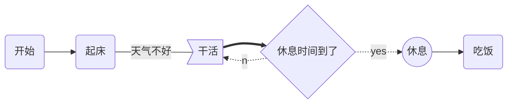
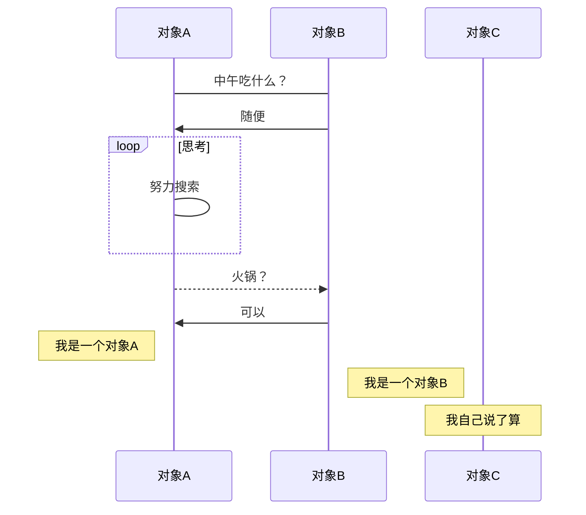
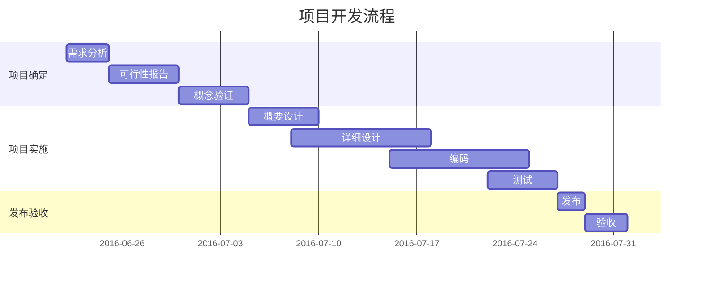

# 1. flow

基本语法：

- 定义模块 id=>关键字: 描述 （“描述”的前面必须有空格，“=>” 两端不能有空格）
- 关键字：
  - start 流程开始，以圆角矩形绘制
  - opearation 操作，以直角矩形绘制
  - condition 判断，以菱形绘制
  - subroutine 子流程，以左右带空白框的矩形绘制
  - inputoutput 输入输出，以平行四边形绘制
  - end 流程结束，以圆角矩形绘制

- 定义模块间的流向：
  - 模块1 id->模块2 id ：一般的箭头指向
  - 条件模块id (描述)->模块id(direction) ：条件模块跳转到对应的执行模块，并指定对应分支的布局方向


  ```flow
  start=>start: API请求
  cache=>operation: 读取Redis缓存
  cached=>condition: 是否有缓存？
  sendMq=>operation: 发送MQ，后台服务更新缓存
  info=>operation: 读取信息
  setCache=>operation: 保存缓存
  end=>end: 返回信息
  start->cache->cached
  cached(yes)->sendMq
  cached(no)->info
  info->setCache
  setCache->end
  sendMq->end
  ```

  # 2. mermaid

**基本语法：**

- graph 指定流程图方向：

  | 用词 | 含义     |
  | :--- | :------- |
  | TB   | 从上到下 |
  | BT   | 从下到上 |
  | RL   | 从右到左 |
  | LR   | 从左到右 |

- 元素的形状定义：

  | 表述       | 说明           |
  | :--------- | :------------- |
  | id[文字]   | 矩形节点       |
  | id(文字)   | 圆角矩形节点   |
  | id((文字)) | 圆形节点       |
  | id>文字]   | 右向旗帜状节点 |
  | id{文字}   | 菱形节点       |

- 线条定义：

  | 表述     | 说明           |
  | :------- | :------------- |
  | >        | 添加尾部箭头   |
  | -        | 不添加尾部箭头 |
  | –        | 单线           |
  | –text–   | 单线上加文字   |
  | ==       | 粗线           |
  | ==text== | 粗线加文字     |
  | -.-      | 虚线           |
  | -.text.- | 虚线加文字     |

- 子流程图定义

  ```
  subgraph title
    graph direction
  end
  ```




# 3. 标准时序图

**基本语法：**

- `Title`:标题 ：指定时序图的标题

- `Note direction of` 对象:描述 ： 在对象的某一侧添加描述，`direction` 可以为 `right/left/over` ， 对象 可以是多个对象，以 , 作为分隔符

- `participant` 对象 ：创建一个对象

- `loop...end` ：创建一个循环体

- ```
  对象A->对象B
  ```

  :描述 ： 绘制A与B之间的对话，以实线连接

  - `->` 实线实心箭头指向
  - `-->` 虚线实心箭头指向
  - `->>` 实线小箭头指向
  - `-->>` 虚线小箭头指向

```sequence
Title:时序图示例
客户端->服务端: 我想找你拿下数据 SYN
服务端-->客户端: 我收到你的请求啦 ACK+SYN
客户端->>服务端: 我收到你的确认啦，我们开始通信吧 ACK
Note right of 服务端: 我是一个服务端
Note left of 客户端: 我是一个客户端
Note over 服务端,客户端: TCP 三次握手
participant 观察者
```

# 4. 序列图

基本语法同标准时序图，不同的是

- 需要使用 `mermaid` 解析，并在开头使用关键字 `sequenceDiagram` 指明

  ```
  sequenceDiagram
      [参与者1][消息线][参与者2]:消息体
      ...
  ```

- 线段的样式遵循`mermaid`的解析方式

  | 类型 | 描述                       |
  | :--- | :------------------------- |
  | ->   | 无箭头的实线               |
  | –>   | 无箭头的虚线               |
  | ->>  | 有箭头的实线               |
  | –>>  | 有箭头的虚线               |
  | -x   | 末端为叉的实线（表示异步） |
  | –x   | 末端为叉的虚线（表示异步   |

- 处理中

  在消息线末尾增加 `+` ，则消息接收者进入当前消息的“处理中”状态；
  在消息线末尾增加 `-` ，则消息接收者离开当前消息的“处理中”状态。

  或者使用以下语法直接说明某个参与者进入“处理中”状态:

	```
	activate 参与者
	```

- 标注

	```
	Note 位置表述 参与者: 标注文字
	```

	其中位置表述可以为

	| 表述     | 含义                       |
	| :------- | :------------------------- |
	| right of | 右侧                       |
	| left of  | 左侧                       |
	| over     | 在当中，可以横跨多个参与者 |

- 循环

	```
	loop 循环的条件
    	循环体描述语句
	end
	```

- 判断

	```
	alt 条件 1 描述
    	分支 1 描述语句
	else 条件 2 描述 # else 分支可选
    	分支 2 描述语句
	else ...
    	...
	end
	```

	如果遇到可选的情况，即没有 else 分支的情况，使用如下语法：

	```
	opt 条件描述
    	分支描述语句
	end
	```




# 5. 甘特图(gantt)

| 标记       | 简介               |
| :--------- | :----------------- |
| title      | 标题               |
| dateFormat | 日期格式           |
| section    | 模块               |
| Completed  | 已经完成           |
| Active     | 当前正在进行       |
| Future     | 后续待处理         |
| crit       | 关键阶段           |
| 日期缺失   | 默认从上一项完成后 |




